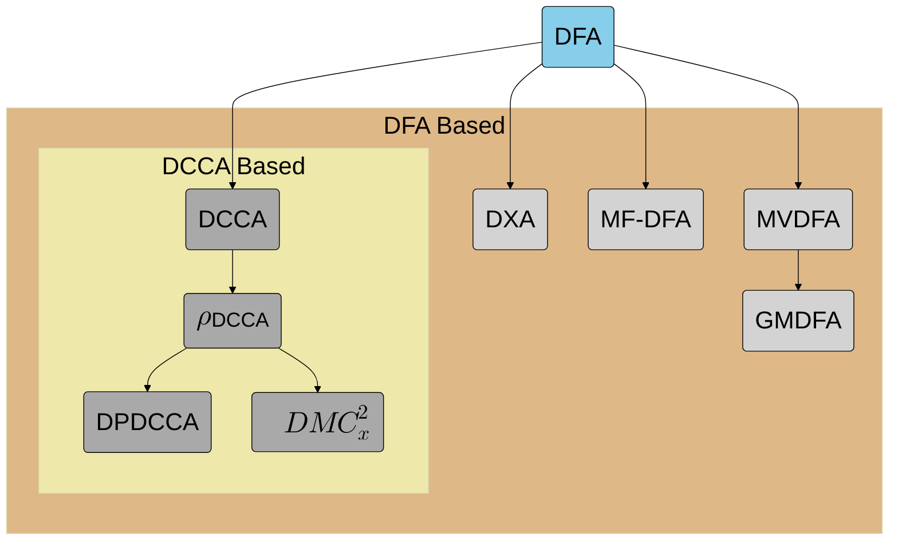

```mermaid
---
config:
  theme: base
  themeVariables:
    primaryColor: LightGrey
    primaryTextColor: Black
    primaryBorderColor: black
    lineColor: Black
    secondaryColor: blue
    tertiaryColor: LightGoldenRodYellow
    fontSize: 30px
  themeCSS: |
    .label {
      text-anchor: start; /* Align text to the left */
    }
    .edgePath path {
      stroke-width: 5px; /* Increase this value to get thicker arrows */
    }
    .edgeLabel {
      font-size: 12px; /* Adjust font size of edge labels if needed */
    }
---

flowchart TD

DFA("DFA") -->  DXA
DFA --> MVDFA
DFA --> MF-DFA
MVDFA --> GMDFA

DFA --> DCCA
DCCA --> P_DCCA
P_DCCA --> DPDCCA
P_DCCA --> run_dmc

subgraph dcca_based["DCCA Based"]
dcca_padding_box

end

subgraph dfa_based["DFA Based"]
  DXA("DXA")
  padding_box
  MF-DFA("MF-DFA")
  MVDFA("MVDFA")
  GMDFA("GMDFA")
 end

subgraph padding_box
  dcca_based
end

subgraph dcca_padding_box
   DCCA("DCCA")
   P_DCCA("$$\rho$$ <sub>DCCA</sub>")
   DPDCCA("DPDCCA")
   run_dmc("$$~~DMC_x^2$$")
  
end


    
%% class definitions

    classDef main_class fill:SkyBlue
    classDef main_box fill:BurlyWood, color:Black, margin:0px
    classDef inside_box fill:PaleGoldenRod, color:black
    classDef indirect_class fill:DarkGray, color:Black

    classDef transparent_class fill:#00000000, color:#00000000, margin-top:500px, stroke:none

%% Class attribution

    dcca_based:::inside_box
    P_DCCA:::indirect_class
    DPDCCA:::indirect_class

    dfa_based:::main_box
    DFA:::main_class
    DCCA:::indirect_class
    P_DCCA:::indirect_class
    run_dmc:::indirect_class
    padding_box:::transparent_class
    dcca_padding_box:::transparent_class

```
